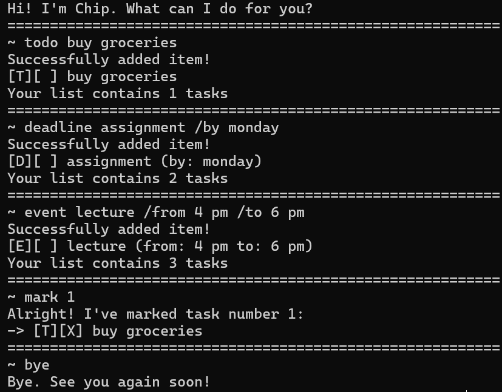

# Chip User Guide



***Chip*** is a task organisation and management chatbot, optimized to interact 
with users via a Command Line Interface (CLI). Through text-based input commands and 
output interactions, Chip can help you store and manage your to-do tasks, events and deadlines.

## Quick Start
1. Ensure your computer has Java 17 or above installed.
2. Download the `.jar` file for Chip.
3. Copy the `.jar` file to a folder. This folder will be used as the home folder by the program.
4. In a command terminal, use `cd` to navigate to the home folder from step 3.
5. Run the command `java -jar ip.jar`. Chip should start, and print a greeting message in the terminal window.
6. You can now type the commands listed in the features below, and execute them by pressing `ENTER`. Chip will print confirmations if your command has executed successfully, and error messages if something went wrong.

## Features
Notes about the command format:
* Words in `UPPER CASE` are parameters to be supplied by the user.
* All listed parameters must be provided for a command to work.
* Parameters must be provided in the same order as in the given format.
* Text parameters (excluding numerical parameters like `INDEX`) can take inputs with multiple words, numbers and special characters, unless specified otherwise.

## Adding a to-do task `todo`  

Adds a to-do task with the given description.  
Format: `todo DESCRIPTION`  

Example: `todo submit assignment`
```
Successfully added item!
[T][ ] submit assignment
Your list contains 1 tasks
```

## Adding a deadline `deadline`

Adds a deadline task with the given description and deadline.  
Format: `deadline DESCRIPTION /by DEADLINE`  

Example: `deadline job application /by monday`
```
Successfully added item!
[D][ ] job application (by: monday)
Your list contains 2 tasks
```

## Adding an event `event`

Adds an event task with the given description, start and end time.  
Format: `event DESCRIPTION /from START /to END`  

Example: `event family dinner /from 8 pm /to 10 pm`
```
Successfully added item!
[E][ ] family dinner (from: 8 pm to: 10 pm)
Your list contains 3 tasks
```


## Viewing your task list `list`

Shows an indexed list of all tasks.  
Format: `list`  

* Tasks are indexed in order of addition.   
* The type of task is indicated by the letter in the first square bracket set. [T]: todo, [D]: deadline, [E]: event.  
* An [X] in the second square bracket set indicates that the task has been marked as done.
```
1. [T][X] submit assignment
2. [D][ ] job application (by: monday)
3. [E][ ] family dinner (from: 8 pm to: 10 pm)
```

## Marking a task as done `mark`

Marks the task at the given index as done.  
Format: `mark INDEX`

Example: `mark 2`
```
Alright! I've marked task number 2:
-> [D][X] job application (by: monday)
```

## Unmarking a task `unmark`

Unmarks the task at the given index as done.  
Format: `unmark INDEX`

Example: `unmark 2`
```
Alright! I've unmarked task number 2:
-> [D][ ] job application (by: monday)
```

## Deleting a task `delete`

Deletes the task at the given index.  
Format: `delete INDEX`

Example: `delete 2`
```
Alright! I've deleted the task: 
-> [D][ ] job application (by: monday)
Your list now contains 2 tasks.
```

## Finding tasks with a keyword `find`

Finds and lists all tasks with descriptions containing the given keyword.  
Format: `find KEYWORD`  
* The search is case-insensitive. e.g. `john` will match `John`.
* Only the description of the tasks are searched.
* A match will be found if a word in the description contains the keyword as a substring. e.g. `tea` will match `teapot`.

Example: `find tea`
```
Here are the matching tasks in your list: 
1. [D][ ] buy tea (by: 6th may)
2. [T][ ] clean teapot
```


## Exiting the program `bye`

Exits and closes the program.  
Format: `bye`
